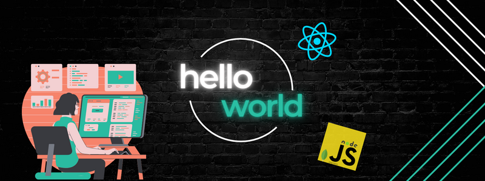

   

<h1 align="center">Hi there 👋, I'm Muhamad Fatah 👩‍💻</h1>

<h3>
Frontend Engineering works with HTML, CSS, and React Js to implement designs from UI/UX into websites. 

I can collaborate with teammates in version control systems such as GitHub, manage responsiveness with CSS frameworks, consumes restful API, and use redux as global state management.  
I have the motivation to work as a front-end developer because it has challenges to solve problems.   
</h3>

---

<h2 align="center">Connect with me:</h2>

  &nbsp;&nbsp;&nbsp;&nbsp;
  &nbsp;&nbsp;&nbsp;&nbsp;
  &nbsp;&nbsp;&nbsp;&nbsp;

 

<h3 align="left">Languages : </h3>

---

 &nbsp&nbsp
 &nbsp&nbsp

 

<h3 align="left">Technologies : </h3>

---

|                                                                          Frontend                                                                          |                                                                         Backend                                                                         |
|:----------------------------------------------------------------------------------------------------------------------------------------------------------:|:-------------------------------------------------------------------------------------------------------------------------------------------------------:|
|           |     |
|                    |  |
|  |  |

 

<h3 align="left">Other Tools : </h3>

---

 

